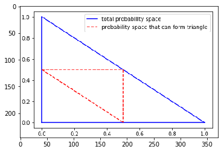
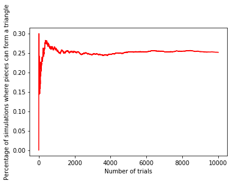

### Stick Problem
#### Question: 
You have a stick of arbitrary length. You break the stick uniformly at random along it’s length at two places, leaving you with three distinct pieces. What is the probability that you can form a triangle with the resulting three pieces?

#### Solution:


To bound the problem, let's our length of the stick has some unit length 1. Now breaking the stick uninformly at random along it's length at 2 places leaves us with 3 pieces. Because we have unit length of 1, only 2 variables x and y are fully specifying the lenghts of the deduced pieces. 1st piece of length x and second piece of length y and the third piece of length 1-x-y

##### Condition 1: <br>
    x < y + (1-x-y)
    x < 1 - x 
    2x < 1 
    x < 1/2 

##### Condition 2: <br>
    y < x + (1 - x - y) 
    y < 1 - y 
    2y < 1 
    y < 1/2
    
##### Condition 3: <br>
    (1-x-y) < x + y 
    2y < -2x + 1 
    y > -x + 1/2 

Overlaying the boundaries in a probabilty space


```python
import matplotlib.pyplot as plt

im = plt.imread('space.png')
# show the image
plt.imshow(im)
plt.show()
```





The figure above clearly shows that the boundary conditions specify 1/4 of the total probability space.

Simulating this problem computationally in python to confirm our analytical solution:


```python

import numpy as np
import pandas as pd
import math
import matplotlib.pyplot as plt
## number of iterations 
iterations = 10000
results = pd.DataFrame()
results['iteration'] = list(range(1,iterations+1))
percentage = iterations*[None]
np.random.seed(10815657)
count = 0
for i in range(0, iterations):
    random_draws = np.random.uniform(low=0, high=1, size=2)
    x = min(random_draws)
    y = abs(random_draws[0] - random_draws[1])
    if((x<0.5) and (y<0.5) and (0.5 < x+y)):
        count=count+1
    percentage[i] = count / (i+1)
results['percentage'] = percentage
plt.plot(results['iteration'], results['percentage'], color='red')
plt.xlabel('Number of trials') 
plt.ylabel('Percentage of simulations where pieces can form a triangle')
print(percentage[iterations-1])
plt
```

    0.2518
    


    <module 'matplotlib.pyplot' from 'C:\\Users\\SilvesterM\\AppData\\Local\\New folder (2)\\lib\\site-packages\\matplotlib\\pyplot.py'>





As shown above, over 10,000 simulations the results converge to probability 1/4 (i.e. 25%) that the three broken pieces can form a triangle


```python

```
